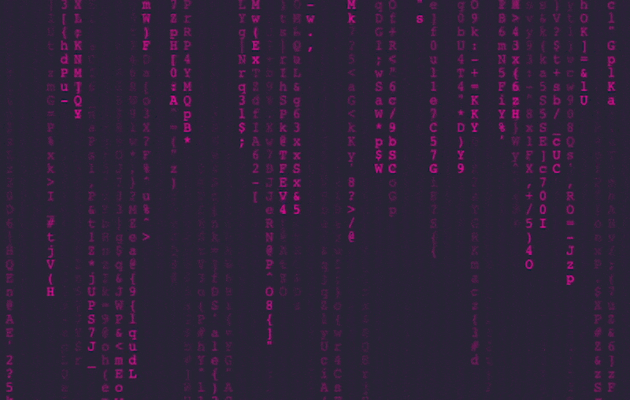

# 🌧️ Digital Rain

Experience the mesmerizing cascade of glowing characters falling like rain across your screen. This captivating visual effect creates an immersive cyberpunk atmosphere that transforms any display into a window to the digital realm. Built with pure JavaScript, HTML, and CSS for maximum performance and customization. 

## Live Preview

Wake up...

Enter the digital realm... [Preview the project on Vercel](<https://matrix-digital-rain.vercel.app>)

## ✨ Features

- **Hypnotic Visual Experience:** Watch as cascading characters create a stunning digital waterfall effect across your entire screen.
- **Customizable Interface:** Easily adjust the font size, text color, and background color directly from the settings panel to tailor the visual experience to your preference.
- **Custom Character Sets:** Define your own alphabet to create unique visual patterns - from classic alphanumeric to exotic symbols.

## 🚀 Getting Started

1. Clone this repository or download the source code as a ZIP file.
2. Open the `index.html` file in a modern web browser.
3. Immerse yourself in the hypnotic flow of digital rain, fully customizable to match your aesthetic vision!

## 🛠 Customization

Transform your digital rain into a unique visual masterpiece with these powerful customization options:

### Through the Settings Panel (New!):
- **Background Color:** Craft the perfect atmosphere with customizable background colors and opacity levels.
- **Rain Color:** Paint your digital rain in any color of the spectrum, with adjustable opacity for subtle or vibrant effects.
- **Character Size:** Fine-tune the scale of falling characters to create anything from a gentle drizzle to a torrential downpour.

### Directly in the Code:
In `style.css`, modify these variables to set default values:
- `--background-color`: Modifies the default background color.
- `--text-color`: Sets the default text color for the characters.
- `--font-size`: Determines the default font size of the characters.

In `script.js`, you can modify:
- `characters`: Change the array of characters used to create unique combinations in the digital rain sequence.

## 📄 License

This project is open source and available under the [MIT License](LICENSE).
