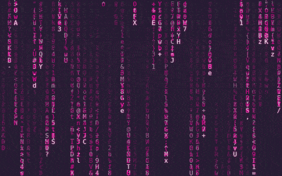

# 🌧️ Digital Rain

Experience the mesmerizing cascade of glowing characters falling like rain across your screen. This captivating visual effect creates an immersive cyberpunk atmosphere that transforms any display into a window to the digital realm. Built with pure JavaScript, HTML, and CSS — no dependencies, no build step.

## Live Preview

Wake up...

Enter the digital realm... [Preview the project on Vercel](<https://matrix-digital-rain.vercel.app>)

## ✨ Features

- **Glowing rain:** Every stream has a bright, glowing head character trailed by mutating glyphs — with per-column speeds so the rain falls naturally, never in lockstep.
- **Theme presets:** Classic **Matrix** green (with half-width katakana, as tradition demands), **Synthwave** pink, **Amber** terminal, and **Ice** blue — or shuffle for a random palette.
- **Custom character sets:** Pick katakana, latin, binary, or symbols — or type your own alphabet (emoji welcome).
- **Fully tweakable:** Rain and background colors, trail length, opacity, font size, speed, density, and glow — all from the settings panel.
- **Synthwave grid:** Optional animated perspective floor grid that scrolls toward you and takes on the rain's color.
- **Gradient trails:** Each stream fades from a bright head through the rain color into the dark for a deeper, more dimensional look.
- **Hidden messages:** Type a phrase and have the rain reveal it — as a centered glowing *Transmission* or *Woven* down a falling column.
- **Shareable links:** The **Share** button copies a URL that encodes your exact look, so anyone who opens it sees the same scene.
- **Remembers your vibe:** Settings persist between visits, with one-click reset to defaults.
- **Screensaver mode:** The UI (and your cursor) fade away after a few idle seconds; go fullscreen for the complete effect.
- **Respectful by default:** Honors `prefers-reduced-motion` with a frozen frame and an explicit play button. Crisp on retina displays. Works on phones with a bottom-sheet settings panel.

## 🚀 Getting Started

1. Clone this repository or download the source code as a ZIP file.
2. Open `index.html` in a modern web browser. That's it — there is no step 3.

## 🛠 Customization

Everything below is available in the settings panel (gear button, top right):

| Setting | What it does |
| --- | --- |
| **Theme** | One-click preset for colors + character set. Touch any color and it becomes *Custom*. |
| **Background** | Background color and trail fade — lower values leave longer ghostly trails. |
| **Digital Rain** | Rain color and opacity. |
| **Characters** | Katakana / Latin / Binary / Symbols, or *Custom* to type your own alphabet. |
| **Font Size / Speed / Density** | From a gentle drizzle to a torrential downpour. |
| **Glow** | Toggles the neon glow on head characters (turn off on slow machines). |
| **Grid** | Toggles an animated synthwave perspective floor grid behind the rain. |
| **Gradient Trails** | Fades each trail from a bright head into the background. |
| **Hidden Message** | A phrase the rain reveals; pick the *Transmission* or *Woven* style. |
| **Share** | Copies a link that encodes your current settings. |
| **Shuffle** | Random color palette, if you're feeling lucky. |

Want different defaults? Edit the `DEFAULTS`, `THEMES`, and `CHARSETS` objects at the top of `script.js` — the whole engine is one readable file.

## 📄 License

This project is open source and available under the [MIT License](LICENSE).
